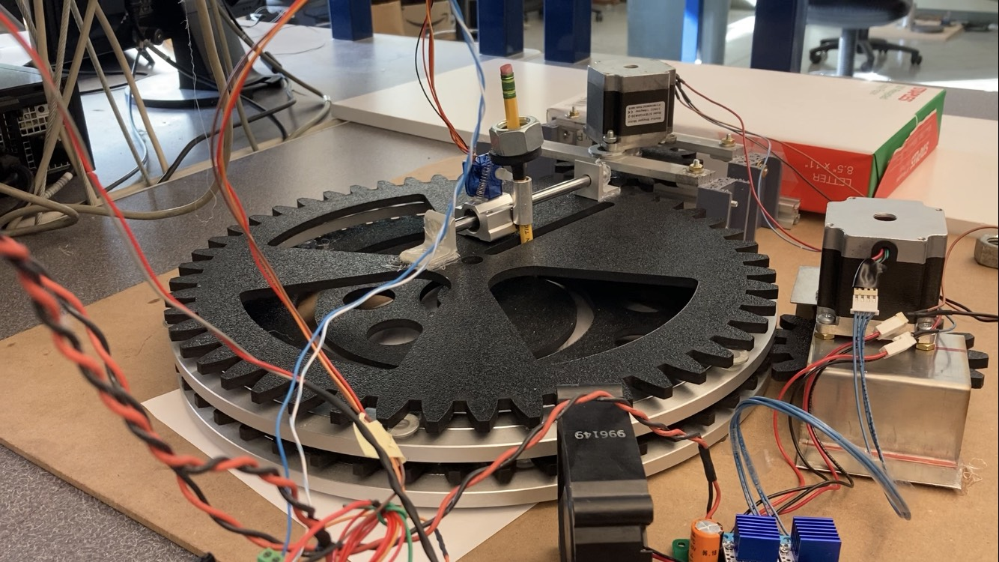
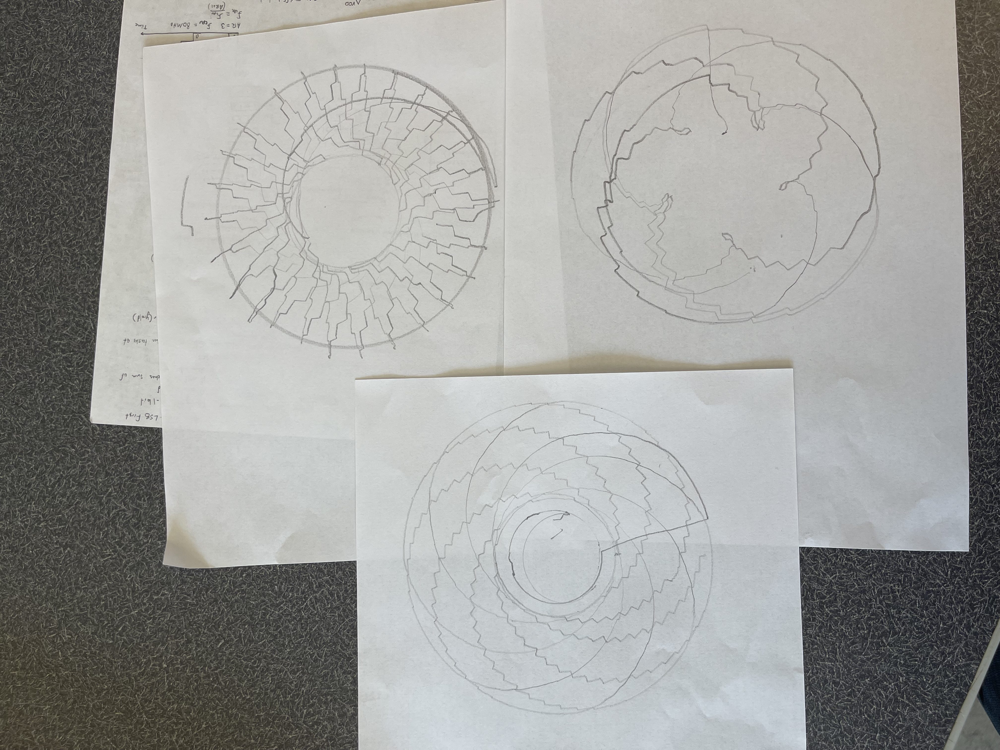

# Pen Plotter
#### Date: 06/04/2022
#### Authors: Tim Matista, Jason Hu
#### Under the Guidance of: Professor Charlie Refvem, Cal Poly SLO

## About
This pen plotter was the term project for my Mechatronics class at Cal Poly. The goal was to produce a robot 
capable of drawing any shape withoutusing a simple gantry system. Our particular design was inspired by 
[*Five Hundred and Seven Mechanical Movements*](http://507movements.com/about.html) by Henry T. Brown, specifically 
[Mechanism 94](http://507movements.com/mm_094.html). The unabridged 
[repository for this project](https://github.com/tmatista/ME405Mecha15) has more detailed information about 
the code, CAD, and hardware that made this project a reality.

## Result
Below an example of the simulated system performance, actual working video, and produced drawings.

